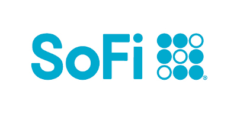
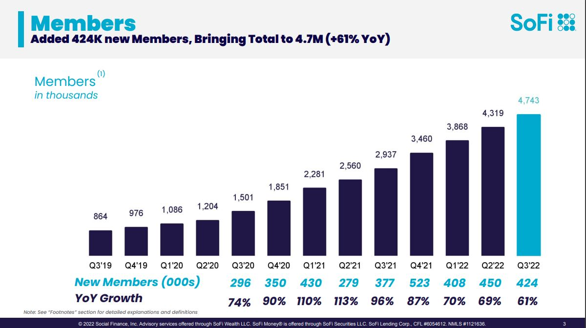

# Sofi's One-Stop-Shop Personal Banking Platform
​
## History and Evolution of SoFi

The [original focus][1] of SoFi was student loans and refinancing.  In a macro sense Sofi has and continues to grow into a “One-Stop-Shop” for all most all personal banking needs.  They foster a culture of learning with the ultimate goal of Financial Independence using clear and easy to understand language. Their products includes Investment banking, Wealth Management, Blockchain and Cryptocurrencies, Personal Finance, Deposits and Online Banking. However, Sofi has gone through it's own trials and tribulations, but let's start at the begining. 

## How it all began

First, SoFi stands for "Social Finance".  The name is significant as "Culture" helps lead the way to SoFi success.  It all started in 2011 four students the Stanford Graduate School of Business wanted to provide more affordable options for students who were accumulating student debt.  Together, Mike Cagney, Dan Macklin, Ian Brady and James Finnigan began a pilot program to lend 100 students approximately $20,000 to help fund their education.  Together SoFi was born and incorporated in August 2011.

Under CEO Mike Cagney leadership he was able to Lead SoFi through several funding rounds.  In 2016 SoFi became the first startup online lender receive a triple-A rating from Moody's.  Grew the membership to 175k members and grew total loan volume to 12 billion. However, Mike Cagney resigned under pressure from sexual aligations, growing rumors of a toxic ["Frat House"][2] work culture and complaince issues.

**Funding Milestones under Cagney**

- August 2011, 40 alumni lent about $2 million for the original pilot program.
- September 2012, Raised $77.2 million seed money from Baseline Ventures, DCM Ventures and Renren.
- October 2013, Raised $500 million in debt and equity.
- April 2014, SoFi raised $80 million in Series C round from Discovery Capital Management, Peter Thiel and Wicklow Capital.
- February 2015, $200 million funding round led by Third Point Management.
- September 2015, $1 billion round of investment from SoftBank.

**Historical Milestones under Cagney**

- May 2016, SoFi becomes the first startup online lender receive a triple-A rating from Moody's.
- October 2016, Sofi reaches $12 billion in total loan volume funded and grows to reaches 175k members.
- January 2018, CEO Mike Cagney resigns in the shadow of allegations of sexual harassment and risk and compliance controls related issues.

## Under New Management

SoFi CEO Anthony Noto has the [strength][2] to lead SoFi into One-Stop-Shop banking dominance in the future.  The SoFI vision is clear when you consider the [life experiences][3] that drives Noto's passion.  At Goldman Sachs in 1999 he was considered a top Analist for his research of the Internet Industry, and led the firms communications, media and entertainment research team.  Years later he returned to Goldman Sachs and conntributed to Goldman's winning the role of lead underwriter of Twitter's ICO in 2013.  He fostered relationships in the NFL as CFO in 2008.  In 2014 he began he role as Twitter's CFO, leveraging his experiece at Goldman Sach when he managed the Twitter account.

**Noto's Childhood, Passion and Mission**

Anthony Noto felt finnancial stress at the age of 3, when his parents divorced. He grew up on food stamps and free lunches.  His family struggled to get the things they wanted.  This is what drove him into West Point and collage.  On now it is what drives him to reach as many people as possible. educate them and provide a path to financial independance.

 

**Sofi's Mission Statment**

> ## SoFi’s mission is to help people reach financial independence to realize their ambitions.

 

Anthony Noto has shown his ability to leverage his experiences to obtain results.  He develops relationships and fosters trust.  For instance, returning to Goldman Sachs to to help land the Twitter underwriting deal. Then again, joining Twitter as the CFO.  Yet again, leveraging his experience and relationships formed during his tenure in the NFL to be awarded the ["SoFi Stadium"][1] deal, the home of L.A. Rams and Chargers is now "SoFi Stadium", a 20 year contract.   Noto has shown a pattern of using expierence, relationships and trust to create accomplishments and success.

**Funding Milestones under Cagney**

- May 2019, $500 million in a single funding round led by Qatar Investment Authority.
- Sofi has a total of [19 funding rounds][9] totaling $3 billon.

**Historical Milestones under Noto**

- January 2018, Anthony Noto leaves as CFO of Twitter and becomes the CEO of SoFi.
- October 2018, FTC alleged that SoFi had been making such false claims since Apri 2016. 
- February 2019, The FTC slaps final consent order on SoFi which will expires 2039.
- September 2019, SoFi wins the SoFi Stadium deal with the NFL.  The home of L.A. Rams and Chargers is now "SoFi Stadium", a 20 year contract!
- April 2020, SoFi acquired payments firm Galileo for $1.2 billion.
- January 2022, SoFi received approval from the OCC for a national bank charter.
- February 2022, Sofi buys Golden Pacific Bancorp and official has a bank charter.
- February 2022, [aquires Technisys][4], a leading cloud-native, digital multi-product core banking      platform.
- October 2022, Galileo and Technisys forms partnership offers CyberBank Digital as a manage service.  A step close in SoFi's pursuit to become the ["AWS of fintech"][4].

 

## SoFi Earnings and Challenges in the Industry.

2022 has been a turbulent time for Fintech lenders.  Rising interest rates, inflation and the Biden’s extension of the moratorium on student loans payments has created challenges for Fintech lending sector. Sofi has faired better than most. The company reported strong revenue growth in Q3 2022. Reporting 1.5 billion in revenue.  While Sofi is not yes profitable, they have made expectations and are expected to [3.6 billion][11] by the end of 2025.

Sofi managed to add [424k members][12] by the third quarter.   The growth came from their Credit score monitoring service “SoFi Relay” at 256k of products, “SoFi Money” at 165k and  “SoFi Invest” at 106K  Totaling 527 products.   “Lending” products and SoFi Credit Card amounted to 78k and 14k of products respectively.  SoFi is growing and expanding services, which helps offset some of the economic conditions affecting the Lending sector. 

Sofi also reported that Galileo, SoFi’s payments technology platform, accounts grew to 124.3k in Q3, a 40% growth compared to Q3 2021.

To define about Sofi's challenges, we need to look at the state of the FinTech Industry and what is effects of outside forces.  The most pressing issue is the Federal government’s [Student Loan forgiveness program.][10]  The Supreme Court is set hear arguments February 28 2023. This issue is creating downward pressure on Sofi’s stock Price.  Until this case is decided, investors will be wary.  Noto has done shifted focus from student loans to other products and service to balance out the detriment effects of Student Loan Forgiveness program.  In fact, SoFi is driving potential members to it's website with the latest information on the program. In effect using the Issue to enhance education for their members.
The FTX scandal is eroding public trust on the crypto and blockchain sector, as details on who, what where and when needs to see daylight.  Sofi has fees attached to the crypto exchange part of their business.  The [lack of regulation][6] of crypto erodes consumer confidence, regulation clarity is needed to restore confidence.

---

> ### As of Q3 2022 Sofi's Membership has grown 976K to **4.7 million** in less than 3 years.

 

## Sofi Company Values

> ## At SoFi, it’s not just what we do—but how we do it.

1. Put our members’ interests first.
2. Run after problems.
3. Embrace diversity. Everyone should feel welcome, included and able to contribute.
4. Get to the truth and make principle-based decisions.
5. Make your footprint bigger than your foot.
6. Do the right thing. If you’re not sure, do the harder thing.
7. Set ambitious goals, be gritty, be accountable.
8. Take care of other people and help them grow.
9. Iterate, learn, innovate.
10. Be SoFi missionaries.
11.  …and don’t forget to smile.

 

---

 

## [Products of SoFi][5]

|Checking and Savings | Sofi Credit Card | SoFi Insights |     
|:--------------------------:|:------------------------:|:----------------------:|
|No accounting fees, 3.5% APY|3% cash bask to financial goals.|Track your money and credit score.|​

 

| SoFi Invest | Student Load Refinancing | Personal loans |      
|:--------------------------:|:------------------------:|:----------------------:|
| OnlineTrading Stock/ETF/IPO/Crypto |4.49% with Autopay .|Low rates and unemployment protection​

 

| Mortgages | Private Student Loans| Sofi Protect |      
|:--------------------------:|:------------------------:|:----------------------:|
| As low 3% for first time home buyers |6 mounth grace period|Auto, Home, Life, Renters Insurance

 

### Sofi Compitition 

[Direct competition][7] from Robinhood and Acorn is another challenge that SoFi will need to negotiate.

### Sofi vs. Robinhood Trading Platform [Comparison][7]

| Sofi | Robinhood |
|:--------------------|:-----------------|
|For new and intermediate investors|For new and intermediate investors|
|0% Commission Fees|0% Commission Fees|
|No Minimum Balance|No Minimum Balance|
|1.25% markup on crypto transactions|$5 per month for margin trading requires, $2000 in brokerage account|
|IRA and Roth accounts|IRA and Roth accounts|
|Two investment styles Active and Passive|Pre-market and After-market Trading|
|Free CPA advisiors and Financial Planing|Investiment information and articles|
|Chat and live Phone Support|Article knowledgebase ? App Chat and live call back|
|One Stop Shop Financial Platform||

---

 

### Sofi vs. Acorn Trading Platform [Comparison][8]

| Sofi | Acorn |
|:--------------------|:-----------------|
|For new and intermediate investors|New Investors|
|0% Commission Fees|Tiered Supscription Model|
|Investors control their portfolios|5 premade portfolios models from "Aggressive" to "Conservative" |
|More investment products|No personalization|
|ETF and Crypto Trading|Acorn "Spend Round up" feature for Che cking account|
|Chat and live Phone Support| Email support Only|
|Free CPA advisiors and Financial Planing||
|One Stop Shop Financial Platform||

---

## Summery and Recommendations

SoFi has great brand recognition with SoFi Staduim.  The One-Stop-Shop is an excellent strategy, as 80% of consumers handle their banking at multiple institutions.  Consumers are evolving towards greater use of mobile banking every day.   Sofi has secured the bank charter, which should bring lending cost down.  SoFi’s Technical platforms of Galileo payment system and Technisys banking platform are a great foundations to future revenue and growth.   The future is bright if they can withstand the economic headwinds of 2023.

- I would recommend to keep push brand recognition.   Focus culture, education and services and social media, it is the forte’ of their CEO Anthony Noto. 

- Marketing should also taget older mainstream consumers, as the "ease of use" of the SoFi moblle platform will appeal to older cunstomers as well.

- Help lobby the US congress to pass legislation and regulations that provide consumer confidence in the Crypto and Blockchain sector.  

- As the latest generation of consumers mature and require financial services, they will gravitate toward Sofi.  Time is on SoFi’s side if they make expectations the next few years

 

## Addendum

[1]: <https://en.wikipedia.org/wiki/SoFi#:~:text=SoFi%2C%20short%20for%20Social%20Finance,debt%20to%20fund%20their%20education.> "originl focus"

[2]: <https://www.fool.com/investing/2021/07/02/why-sofis-leadership-is-a-company-strength/> "Frat House"

[3]: <https://www.wikiwand.com/en/Anthony_Noto#Early_life_and_education> "life experiences"

[4]: <https://www.sofi.com/press/sofi-to-acquire-technisys#:~:text=Announces%20Agreement%20to%20Acquire%20Technisys,-Acquisition%20Accelerates%20SoFi's&text=SAN%20FRANCISCO%2C%20California%20%E2%80%93%20February%2022,2022%20%E2%80%93%20SoFi%20Technologies%2C%20Inc.> "aquires Technisys"

[5]: <https://www.sofi.com/products/> "Products of SoFi"

[6]: <https://www.paymentsjournal.com/lack-of-regulation-holds-back-crypto-adoption/#:~:text=Cryptocurrency%20markets%20have%20often%20sold,governments%20do%20not%20control%20money.> "lack of regulation"

[7]: <https://smartasset.com/investing/sofi-vs-robinhood-which-is-better> "Comparison"

[8]: <https://smartasset.com/investing/sofi-vs-acorns> "Comparison"

[9]: <https://www.crunchbase.com/organization/social-finance/company_financials> "19 funding rounds"

[10]: <https://www.businessinsider.com/when-is-supreme-court-hearing-student-loan-debt-forgiveness-february-2022-12> "Student Loan forgiveness program."

[11]: <https://www.fool.com/investing/2022/09/17/where-will-sofi-be-in-3-years/> "3.6 billion"

[12]: <https://www.popularfintech.com/p/sofi-q3-2022-earnings-review-the>  "424k members"
---

[SoFi Wiki - "original focus", "SoFi Stadium"](https://en.wikipedia.org/wiki/SoFi#:~:text=SoFi%2C%20short%20for%20Social%20Finance,debt%20to%20fund%20their%20education.)

[Motley Fool - "Frat House", "strength"](https://www.fool.com/investing/2021/07/02/why-sofis-leadership-is-a-company-strength/)

[WikiWand - "life experiences"](https://www.wikiwand.com/en/Anthony_Noto#Early_life_and_education)

[Sofi.com - "aquires Technisys", "AWS of fintech"](https://www.sofi.com/press/sofi-to-acquire-technisys#:~:text=Announces%20Agreement%20to%20Acquire%20Technisys,-Acquisition%20Accelerates%20SoFi's&text=SAN%20FRANCISCO%2C%20California%20%E2%80%93%20February%2022,2022%20%E2%80%93%20SoFi%20Technologies%2C%20Inc.)

[Sofi.com Products - "Products of SoFi"](https://www.sofi.com/products/)

[Paymentsjournal.com - "lack of regulation"](https://www.paymentsjournal.com/lack-of-regulation-holds-back-crypto-adoption/#:~:text=Cryptocurrency%20markets%20have%20often%20sold,governments%20do%20not%20control%20money.)

[Smartasset.com - "Comparison Robinhood"](https://smartasset.com/investing/sofi-vs-robinhood-which-is-better)

[Smartasset.com - "Comparison Acorn"](https://smartasset.com/investing/sofi-vs-acorns)

[crunchbase.com - "19 funding rounds"](https://www.crunchbase.com/organization/social-finance/company_financials)

[businessinsider.com - "Student Loan forgiveness program."](https://www.businessinsider.com/when-is-supreme-court-hearing-student-loan-debt-forgiveness-february-2022-12)

[fool.com- "3.6 billion"](https://www.fool.com/investing/2022/09/17/where-will-sofi-be-in-3-years/)

[PopularFinTech.com - "424k members"](https://www.popularfintech.com/p/sofi-q3-2022-earnings-review-the)

---

​